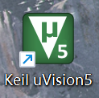
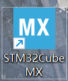
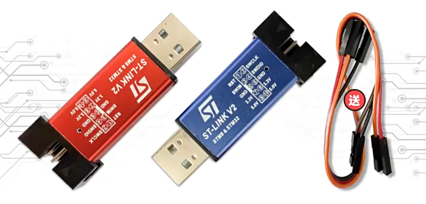
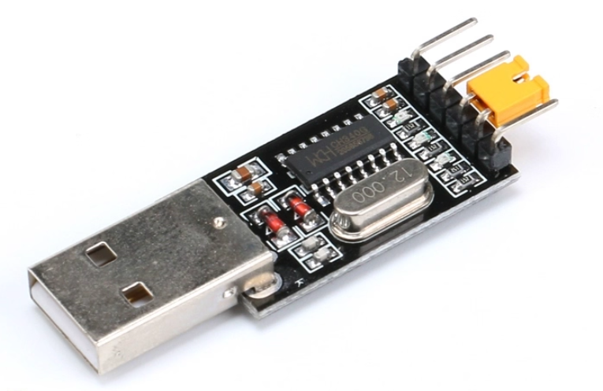

# 2025年盟升杯低年级组C题信号识别与分离装置教程文档

## 版本说明

**该版本由ConstString于2025/9/4最后编辑**

## 本仓库提供下列配置教程

- **[ADC+DMA配置](https://github.com/ConstStrings/2025UESTCMengShengCup_C/blob/master/doc/1.ADC%E9%85%8D%E7%BD%AE%E6%95%99%E7%A8%8B.md)**
- **[DAC+DMA配置](https://github.com/ConstStrings/2025UESTCMengShengCup_C/blob/master/doc/2.DAC%E9%85%8D%E7%BD%AE%E6%95%99%E7%A8%8B.md)**
- **[DSP库配置](https://github.com/ConstStrings/2025UESTCMengShengCup_C/blob/master/doc/3.DSP%E9%85%8D%E7%BD%AE%E6%95%99%E7%A8%8B.md)**

## 仓库组成

- **doc：存放教程文档**
- **imgs：存放图片文件**

## 在查看教程前需要完成什么？

### 软件安装

**Keil uvision5**

**STM32CubeMX**

**安装教程B站自行搜索**

### 硬件准备

**不在元件包中提供，但强烈建议购买的元件：**

- **STLINK烧录调试器（款式不唯一）**

  

- **USB转TTL（串口）（款式不唯一）**

  

### 相关知识

**需要最基本的C语言知识，能够理解常见变量类型，明白函数的概念，了解数组的概念**

## 在哪里能找到相关资源？

**教程相关资源会在Github和群文件同步更新，如果缺少必要文件或者仍有疑问可以通过QQ联系我**