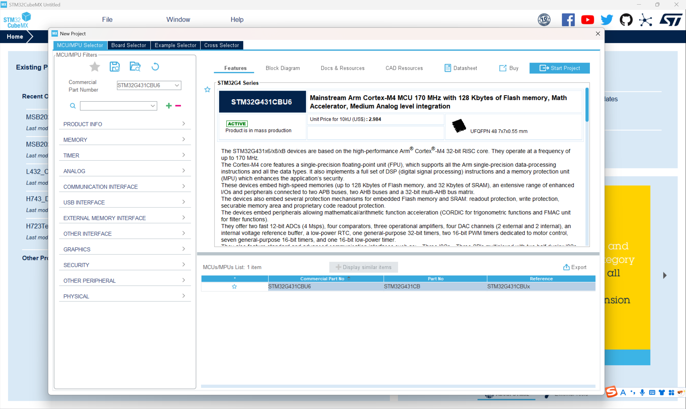
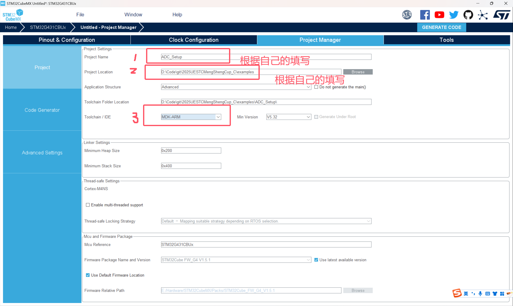

# 2025盟升杯电子设计竞赛C题

## ADC配置教程 By ConstString

### 本例程已上传examples文件夹

### 创建工程

**1.打开STM32CUBEMX软件，选择FILE -> New Project, 搜索本次器件包中发放的单片机型号：STM32G431CBU6**



**2.在搜索结果中选中型号后点击Start Project，出现如下界面，接下来我们一步步配置左侧的外设**


**3.先配置RCC时钟来源，选择高速和低速时钟源均为晶振，其他不用管**


**4.点击SYS，在Debug选项选择Serial Wire，这一步非常重要，在今后的工程中一定不要忘记这一步。这一步操作的目的是开启程序烧录和调试的接口，如果忘记这一步，下一次程序将无法烧录到芯片中！需要使用串口下载解锁（自行搜索）**


**5.至此基本配置已经完成，下面我们开始配置ADC。点击左侧Analog（模拟），选择ADC1。上方的IN1，IN2是选择输入通道，可以理解为从哪个引脚输入，这里我选择IN1即PA0，输入模式为Single-ended，可以看到右侧的PA0已经提示被ADC IN1占用**


**6.在配置ADC具体参数前，我们需要先完成单片机时钟配置，时钟相当于单片机的心跳，是一切程序和指令运行的基准。切换到上方的Clock Configuration，下面是STM32G431是时钟树**


**7.左侧选择晶振频率，开发板上的晶振频率就是8MHz，这里不用修改。我们直接在右侧框中输入170（就是170，该单片机的最大主频）尝试让CUBEMX自动设置，一路OK。然后发现Cubemx找不到170MHz的解，帮我们设置成了150MHz**


**但事实上频率是完全可以拉到170MHz的，我们只需要把锁相环倍数拉到X85**


**到此为止时钟基本配置完了（一会还得回来配一下ADC时钟）**

**8.返回ADC配置页面，在Parameter Settings我们需要修改三个地方，其他保持默认即可，为什么要这样设置会在后面的采样率计算部分讲解**


**9.在ADC配置好后，我们需要为ADC配置DMA，想了解为什么要使用DMA可以观看下面链接的视频：**

**https://www.bilibili.com/video/BV1iV4y1f71L**


**10.下一步需要开启ADC中断，这样我们就能知道ADC什么时候采集完成了数据**

**了解什么是中断，为什么要使用中断可以看下面的视频：**

**https://www.bilibili.com/video/BV17w411y7pj**


**11.除ADC外，还要开启串口方便我们观察ADC读取到的数据（需要自行购买USB转TTL，也可以找别人借，这玩意很常用）**


**12.配置已经全部完成，接下来就是生成工程了**。**上方切换到Project Manager，填写工程名和路径，选择工具链为MDK-ARM**



**13.（可选）生成.h文件，方便管理**


**14.点击右上角GENERATE CODE生成**


### 编写代码

#### 注意：请在CubeMX生成的begin和end之间写自己的代码，不然下次使用CubeMX时会被覆盖！！！

**在这种地方写**


**1.公欲利其事，必先利其器。我们先配置好串口功能，方便我们后续进行调试**

在C语言中，printf函数可以打印字符串到终端上，同样的，我们定义函数myprintf将字符串通过串口进行发送。我们把下面的代码添加到main.c中（如果不会请查阅C语言自定义函数，这属于C语言基本语法）

```c
#include <string.h>
#include <stdarg.h>
#include <stdio.h>

int myprintf(const char *format, ...)
{
    char buffer[128]; 
    va_list args;
    va_start(args, format);
    vsnprintf(buffer, sizeof(buffer), format, args);
    va_end(args);

    return HAL_UART_Transmit(&huart3, (uint8_t*)buffer, strlen(buffer), HAL_MAX_DELAY);
}
```

在main函数中调用myprintf，注意，使用串口要在串口初始化函数（CubeMX自动生成）后面


接下来我们先编译程序


没有error后烧录，STLink烧录器连接如下（STLink元件包不提供，但非常常用，建议自行购买也可以找别人借）。如果提示没驱动自己百度一下，非常简单

| ST-LINK-V2 | STM32开发板 |
| ---------- | ----------- |
| 3.3v       | 3.3v        |
| GND        | GND         |
| SWCLK      | SWCLK       |
| SWDIO      | SWDIO       |

点击烧录


在CubeMX中可以查看USART3_TX为PB10引脚，RX为PB11引脚，需要与USB转串口模块上的RX,TX交叉连接，并连接GND


在电脑上打开串口助手，个人推荐VOFA+，可以显示波形。选择端口号（根据你自己的电脑来），比特率选择115200


按下Reste复位开发板后（烧录完程序要重启开发板才会运行，不要以为是程序出问题了），串口成功打印字符


**2.ADC采样**

定义全局数组存放ADC采样数据，数组长度根据需要确定，这里我先选择512点

由于G431的ADC精度为12位，而C语言中只提供8的整数位的数据类型，声明数组类型为u1int16_t即无符号整形16位

```c
uint16_t My_adcData [512]={0};
```

在main.c中定义ADC中断回调函数，这个函数的函数名是特殊的，当ADC采集512个点结束后会自动调用这个函数。我们希望在ADC采集结束后打印出采集到的数据值，因此在回调函数中使用for循环打印：

```c
void HAL_ADC_ConvCpltCallback(ADC_HandleTypeDef* hadc)
{
    if(hadc->Instance == ADC1)
    {
        for(int i = 0; i < 512; i++)
		{
			myprintf("ADC_Data[%d]:%d\n",i, My_adcData[i]);
		}
	}
}
```

接下来我们在main函数中手动开启ADC采样：

```c
HAL_ADC_Start_DMA(&hadc1, (uint32_t *)My_adcData, 512); // 用的哪个ADC，存在哪个数组里面，数组长度（采样点数）
```

编译并烧录程序到开发板


打开串口助手，重启开发板观察串口输出


可以看到已经有数据输出，说明回调函数工作正常，我这里数据均为0是因为有1M欧下拉电阻，同学们测试时可能是一个随机跳动的数字

接下来我们将信号发生器设置为正弦波，频率为10kHz，低电平为0V，高电平为3V（注意一定不要输入负压，会烧毁ADC）


在vofa中添加波形图，将波形来源设置为I0


将信号源输出接到单片ADC输入端后打开Output，重启单片机，查看串口数据


恭喜你，已经完成ADC+DMA的配置，这将是你电子设计道路上的一大步

如果希望在一次发送后立刻进行下一次采集，可以在回调函数最后开启下一次采集：

```C
void HAL_ADC_ConvCpltCallback(ADC_HandleTypeDef* hadc)
{
    if(hadc->Instance == ADC1)
    {
        for(int i = 0; i < 512; i++)
		{
			myprintf("ADC_Data[%d]:%d\n",i, My_adcData[i]);
		}
		HAL_ADC_Start_DMA(&hadc1, (uint32_t *)My_adcData, 512); 
	}
}
```

### 相关计算

现在我们已经成功获取到了波形，但是我们如何知道每两个数据点之间是时间间隔呢？对于频率测量这是不可或缺的。

假设ADC采样一次需要N个时钟周期，每个时钟周期为T，则采样间隔为：
$$
Priod=N\times T
$$
还记得我们之前配置ADC时选择的参数吗：


在3处有参数Sampling Time，代表需要采样47.5个时钟周期。除此之外，ADC还有固定位12.5个时钟周期的转化时间。因此ADC采样一个点所需的时间应该是两部分相加：
$$
T_{point}=T_{Sampling}+T_{Conversion}=47.5+12.5=60 Clock Cycle
$$
现在只需要知道时钟周期就可以算出具体的间隔时间了，我们打开时钟树：


ADC时钟频率为170MHz，在上一张图片中有一个参数 **Clock Prescaler** **:Asynchronous clock mode divided by 4**表明时钟信号在进入ADC前经过4分频，因此实际ADC时钟频率为：
$$
f_{ADC}=\frac{f_{clockin}}{Prescaler}=42.5MHz
$$
因此ADC采样率（每秒采样点数）为：
$$
f_{SampleRate}=\frac{f_{ADC}}{T_{Point}}=708333kHz
$$

### 结语

**ADC+DMA的配置到此结束，教程制作实属不易，花费了我不少休息时间，希望能够帮到大家，如果觉得有问题或者没有讲清楚的地方欢迎通过QQ等方式向我提出，预祝大家比赛取得好成绩！**

### 完整代码

**main.c**

```C
/* USER CODE BEGIN Header */
/**
  ******************************************************************************
  * @file           : main.c
  * @brief          : Main program body
  ******************************************************************************
  * @attention
  *
  * Copyright (c) 2025 STMicroelectronics.
  * All rights reserved.
  *
  * This software is licensed under terms that can be found in the LICENSE file
  * in the root directory of this software component.
  * If no LICENSE file comes with this software, it is provided AS-IS.
  *
  ******************************************************************************
  */
/* USER CODE END Header */
/* Includes ------------------------------------------------------------------*/
#include "main.h"
#include "adc.h"
#include "dma.h"
#include "usart.h"
#include "gpio.h"

/* Private includes ----------------------------------------------------------*/
/* USER CODE BEGIN Includes */
#include <string.h>
#include <stdarg.h>
#include <stdio.h>
/* USER CODE END Includes */

/* Private typedef -----------------------------------------------------------*/
/* USER CODE BEGIN PTD */

/* USER CODE END PTD */

/* Private define ------------------------------------------------------------*/
/* USER CODE BEGIN PD */

/* USER CODE END PD */

/* Private macro -------------------------------------------------------------*/
/* USER CODE BEGIN PM */

/* USER CODE END PM */

/* Private variables ---------------------------------------------------------*/

/* USER CODE BEGIN PV */
uint16_t My_adcData [512]={0};
/* USER CODE END PV */

/* Private function prototypes -----------------------------------------------*/
void SystemClock_Config(void);
/* USER CODE BEGIN PFP */

/* USER CODE END PFP */

/* Private user code ---------------------------------------------------------*/
/* USER CODE BEGIN 0 */
int myprintf(const char *format, ...)
{
    char buffer[128]; 
    va_list args;
    va_start(args, format);
    vsnprintf(buffer, sizeof(buffer), format, args);
    va_end(args);

    return HAL_UART_Transmit(&huart3, (uint8_t*)buffer, strlen(buffer), HAL_MAX_DELAY);
}
/* USER CODE END 0 */

/**
  * @brief  The application entry point.
  * @retval int
  */
int main(void)
{
  /* USER CODE BEGIN 1 */

  /* USER CODE END 1 */

  /* MCU Configuration--------------------------------------------------------*/

  /* Reset of all peripherals, Initializes the Flash interface and the Systick. */
  HAL_Init();

  /* USER CODE BEGIN Init */

  /* USER CODE END Init */

  /* Configure the system clock */
  SystemClock_Config();

  /* USER CODE BEGIN SysInit */

  /* USER CODE END SysInit */

  /* Initialize all configured peripherals */
  MX_GPIO_Init();
  MX_DMA_Init();
  MX_ADC1_Init();
  MX_USART3_UART_Init();
  /* USER CODE BEGIN 2 */
  myprintf("System Start!\n");
  HAL_ADC_Start_DMA(&hadc1, (uint32_t *)My_adcData, 512); // 用的哪个ADC，存在哪个数组里面，数组长度（采样点数）
  /* USER CODE END 2 */

  /* Infinite loop */
  /* USER CODE BEGIN WHILE */
  while (1)
  {
    /* USER CODE END WHILE */

    /* USER CODE BEGIN 3 */
  }
  /* USER CODE END 3 */
}

/**
  * @brief System Clock Configuration
  * @retval None
  */
void SystemClock_Config(void)
{
  RCC_OscInitTypeDef RCC_OscInitStruct = {0};
  RCC_ClkInitTypeDef RCC_ClkInitStruct = {0};

  /** Configure the main internal regulator output voltage
  */
  HAL_PWREx_ControlVoltageScaling(PWR_REGULATOR_VOLTAGE_SCALE1_BOOST);

  /** Initializes the RCC Oscillators according to the specified parameters
  * in the RCC_OscInitTypeDef structure.
  */
  RCC_OscInitStruct.OscillatorType = RCC_OSCILLATORTYPE_HSE;
  RCC_OscInitStruct.HSEState = RCC_HSE_ON;
  RCC_OscInitStruct.PLL.PLLState = RCC_PLL_ON;
  RCC_OscInitStruct.PLL.PLLSource = RCC_PLLSOURCE_HSE;
  RCC_OscInitStruct.PLL.PLLM = RCC_PLLM_DIV2;
  RCC_OscInitStruct.PLL.PLLN = 85;
  RCC_OscInitStruct.PLL.PLLP = RCC_PLLP_DIV2;
  RCC_OscInitStruct.PLL.PLLQ = RCC_PLLQ_DIV2;
  RCC_OscInitStruct.PLL.PLLR = RCC_PLLR_DIV2;
  if (HAL_RCC_OscConfig(&RCC_OscInitStruct) != HAL_OK)
  {
    Error_Handler();
  }

  /** Initializes the CPU, AHB and APB buses clocks
  */
  RCC_ClkInitStruct.ClockType = RCC_CLOCKTYPE_HCLK|RCC_CLOCKTYPE_SYSCLK
                              |RCC_CLOCKTYPE_PCLK1|RCC_CLOCKTYPE_PCLK2;
  RCC_ClkInitStruct.SYSCLKSource = RCC_SYSCLKSOURCE_PLLCLK;
  RCC_ClkInitStruct.AHBCLKDivider = RCC_SYSCLK_DIV1;
  RCC_ClkInitStruct.APB1CLKDivider = RCC_HCLK_DIV1;
  RCC_ClkInitStruct.APB2CLKDivider = RCC_HCLK_DIV1;

  if (HAL_RCC_ClockConfig(&RCC_ClkInitStruct, FLASH_LATENCY_4) != HAL_OK)
  {
    Error_Handler();
  }
}

/* USER CODE BEGIN 4 */
void HAL_ADC_ConvCpltCallback(ADC_HandleTypeDef* hadc)
{
    if(hadc->Instance == ADC1)
    {
        for(int i = 0; i < 512; i++)
		{
			myprintf("ADC_Data[%d]:%d\n",i, My_adcData[i]);
		}
	}
}
/* USER CODE END 4 */

/**
  * @brief  This function is executed in case of error occurrence.
  * @retval None
  */
void Error_Handler(void)
{
  /* USER CODE BEGIN Error_Handler_Debug */
  /* User can add his own implementation to report the HAL error return state */
  __disable_irq();
  while (1)
  {
  }
  /* USER CODE END Error_Handler_Debug */
}

#ifdef  USE_FULL_ASSERT
/**
  * @brief  Reports the name of the source file and the source line number
  *         where the assert_param error has occurred.
  * @param  file: pointer to the source file name
  * @param  line: assert_param error line source number
  * @retval None
  */
void assert_failed(uint8_t *file, uint32_t line)
{
  /* USER CODE BEGIN 6 */
  /* User can add his own implementation to report the file name and line number,
     ex: printf("Wrong parameters value: file %s on line %d\r\n", file, line) */
  /* USER CODE END 6 */
}
#endif /* USE_FULL_ASSERT */

```

