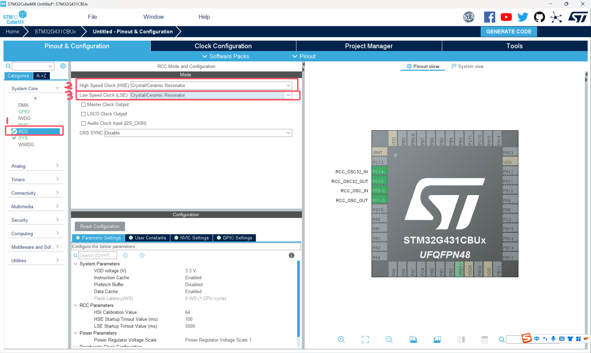
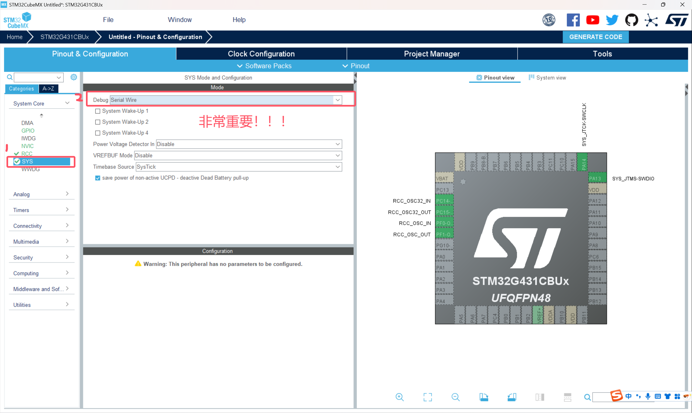

# 2025盟升杯电子设计竞赛C题

## ADC配置教程 By ConstString

### 创建工程

**1.打开STM32CUBEMX软件，选择FILE -> New Project, 搜索本次器件包中发放的单片机型号：STM32G431CBU6**


**2.在搜索结果中选中型号后点击Start Project，出现如下界面，接下来我们一步步配置左侧的外设**


**3.先配置RCC时钟来源，选择高速和低速时钟源均为晶振，其他不用管**



**4.点击SYS，在Debug选项选择Serial Wire，这一步非常重要，在今后的工程中一定不要忘记这一步。这一步操作的目的是开启程序烧录和调试的接口，如果忘记这一步，下一次程序将无法烧录到芯片中！需要使用串口下载解锁（自行搜索）**



**5.至此基本配置已经完成，下面我们开始配置ADC。点击左侧Analog（模拟），选择ADC1。上方的IN1，IN2是选择输入通道，可以理解为从哪个引脚输入，这里我选择IN1即PA0，输入模式为Single-ended，可以看到右侧的PA0已经提示被ADC IN1占用**


**6.在配置ADC具体参数前，我们需要先完成单片机时钟配置，时钟相当于单片机的心跳，是一切程序和指令运行的基准。切换到上方的Clock Configuration，下面是STM32G431是时钟树**


**7.左侧选择晶振频率，开发板上的晶振频率就是8MHz，这里不用修改。我们直接在右侧框中输入170（就是170，该单片机的最大主频）尝试让CUBEMX自动设置，一路OK。然后发现Cubemx找不到170MHz的解，帮我们设置成了150MHz**


**但事实上频率是完全可以拉到170MHz的，我们只需要把锁相环倍数拉到X85**


**到此为止时钟基本配置完了（一会还得回来配一下ADC时钟）**

**8.返回ADC配置页面，在Parameter Settings我们需要修改三个地方，其他保持默认即可，为什么要这样设置会在后面的采样率计算部分讲解**


**9.在ADC配置好后，我们需要为ADC配置DMA，想了解为什么要使用DMA可以观看下面链接的视频：**

**https://www.bilibili.com/video/BV1iV4y1f71L**


**10.下一步需要开启ADC中断，这样我们就能知道ADC什么时候采集完成了数据**

**了解什么是中断，为什么要使用中断可以看下面的视频：**

**https://www.bilibili.com/video/BV17w411y7pj**


**11.除ADC外，还要开启串口方便我们观察ADC读取到的数据（需要自行购买USB转TTL，也可以找别人借，这玩意很常用）**


**12.配置已经全部完成，接下来就是生成工程了**。**上方切换到Project Manager，填写工程名和路径，选择工具链为MDK-ARM**


**13.（可选）生成.h文件，方便管理**


**14.点击右上角GENERATE CODE生成**


### 编写代码

#### 注意：请在CubeMX生成的begin和end之间写自己的代码，不然下次使用CubeMX时会被覆盖！！！

**在这种地方写**


**1.公欲利其事，必先利其器。我们先配置好串口功能，方便我们后续进行调试**

在C语言中，printf函数可以打印字符串到终端上，同样的，我们定义函数myprintf将字符串通过串口进行发送。我们把下面的代码添加到main.c中（如果不会请查阅C语言自定义函数，这属于C语言基本语法）

```c
#include <string.h>
#include <stdarg.h>
#include <stdio.h>

int myprintf(const char *format, ...)
{
    char buffer[128]; 
    va_list args;
    va_start(args, format);
    vsnprintf(buffer, sizeof(buffer), format, args);
    va_end(args);

    return HAL_UART_Transmit(&huart1, (uint8_t*)buffer, strlen(buffer), HAL_MAX_DELAY);
}
```

在main函数中调用myprintf，注意，使用串口要在串口初始化函数（CubeMX自动生成）后面

