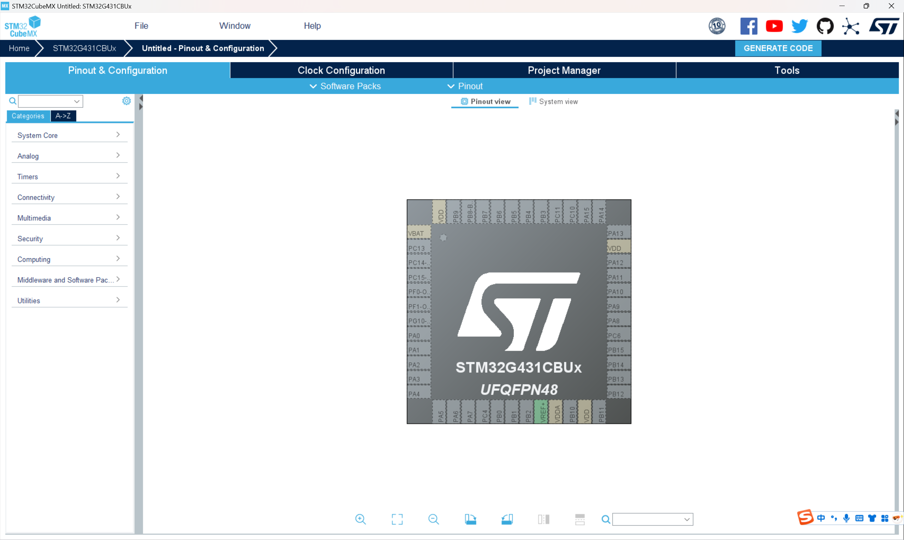
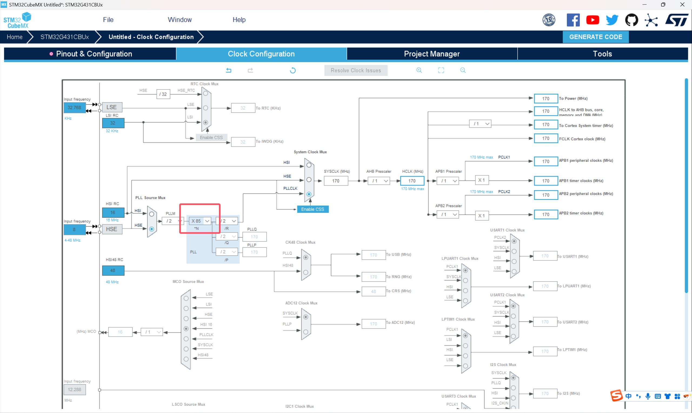
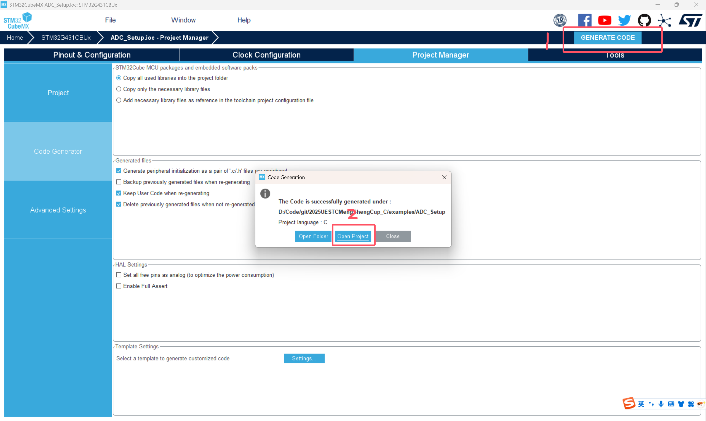
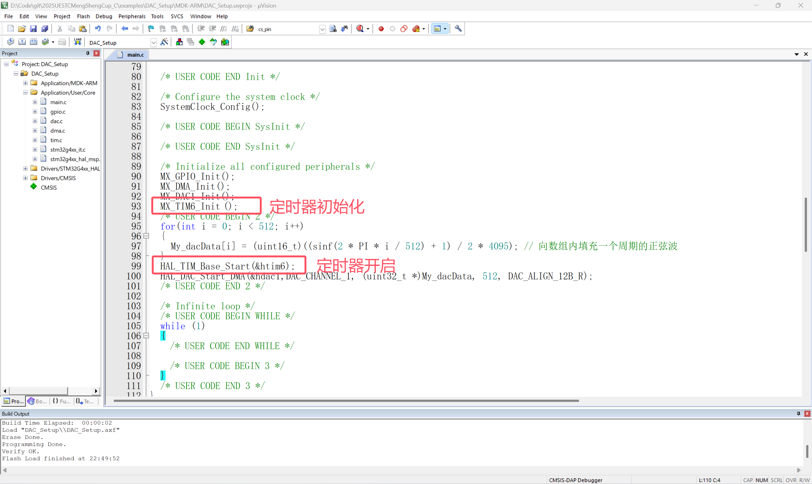

# 2025盟升杯电子设计竞赛C题

## DAC配置教程 By ConstString

### 本例程已上传examples文件夹

### 创建工程(前面和ADC教程配置相同)

**1.打开STM32CUBEMX软件，选择FILE -> New Project, 搜索本次器件包中发放的单片机型号：STM32G431CBU6**


**2.在搜索结果中选中型号后点击Start Project，出现如下界面，接下来我们一步步配置左侧的外设**



**3.先配置RCC时钟来源，选择高速和低速时钟源均为晶振，其他不用管**


**4.点击SYS，在Debug选项选择Serial Wire，这一步非常重要，在今后的工程中一定不要忘记这一步。这一步操作的目的是开启程序烧录和调试的接口，如果忘记这一步，下一次程序将无法烧录到芯片中！需要使用串口下载解锁（自行搜索）**


**5.至此基本配置已经完成，下面我们开始配置DAC。点击左侧Analog（模拟），选择DAC1。上方的OUT1，OUT2是选择输出通道，可以理解为从哪个引脚输出，这里我选择OUT1即PA4，输入模式为Connect to external pin only，可以看到右侧的PA4已经提示被DAC_OUT1占用**


**6.在Parameter Settings我们需要修改两个地方，其他保持默认即可。关闭Out Buffer可以使得输出的最小电压更低，感兴趣的同学可以自行查阅。Trigger可以简单理解为DAC的时钟，触发一次DAC输出一个数据点。我们选择定时器6为触发源，即使用定时器6控制DAC输出速率，我们将在稍后配置定时器6**


**7.切换到DMA Settings配置DMA，DMA的作用在ADC配置教程已经讲解过，不再重复。要配置的地方比较多，大家不要漏掉了。DMA通道最好选一个和ADC不一样的，ADC我们选择DMA，因此这里我们选择DMA2。模式选择Circular，区别在于在环形模式下，当一次DMA数组发送结束后会立刻从头开始下一次发送，而普通模式会停止。外设的位宽选择Word**


**8.接下来配置定时器6，先点击Activated使能定时器。计时周期的计算将在最后一个部分相关计算进行讲解，这里大家先照着填就行。Trigger Event选择Update Event以绑定DAC**


**9.最后完成单片机时钟配置，和ADC教程部分相同。切换到上方的Clock Configuration，下面是STM32G431是时钟树**


**7.左侧选择晶振频率，开发板上的晶振频率就是8MHz，这里不用修改。我们直接在右侧框中输入170（就是170，该单片机的最大主频）尝试让CUBEMX自动设置，一路OK。然后发现Cubemx找不到170MHz的解，帮我们设置成了150MHz**


**但事实上频率是完全可以拉到170MHz的，我们只需要把锁相环倍数拉到X85**



**8.配置已经全部完成，接下来就是生成工程了**。**上方切换到Project Manager，填写工程名和路径，选择工具链为MDK-ARM**


**13.（可选）生成.h文件，方便管理**


**14.点击右上角GENERATE CODE生成**



### 编写代码

#### 注意：请在CubeMX生成的begin和end之间写自己的代码，不然下次使用CubeMX时会被覆盖！！！

**在这种地方写**


**1.DAC+DMA输出**

定义全局数组存放DAC输出数据，数组长度根据需要确定，这里我先选择512点

由于G431的DAC精度为12位，而C语言中只提供8的整数位的数据类型，声明数组类型为u1int16_t即无符号整形16位

```c
uint16_t My_dacData [512]={0};
```

我们需要在这个数组中填充我们我们想要输出的波形，以正弦波为例。向DAC写入数据0代表输出0V，写入4095（二进制111111111111）输出3.3V（并非严格3.3V，原因感兴趣自行查找），因此需要对sin函数（输出-1~1）进行一些适当的转化再写入到数组中

```c
#include <math.h>

#define PI 3.1415926

for(int i = 0; i < 512; i++)
{
	My_dacData[i] = (uint16_t)((sinf(2 * PI * i / 512) + 1) / 2 * 4095); // 向数组内填充一个周期的正弦波
}
```

定时器需要手动开启，和ADC教程中的串口一样，需要在初始化之后调用



调用函数HAL_DAC_Start_DMA开始DAC输出。与ADC不同，我们设置DMA为Circular模式，因此只需要调用该函数一次就可实现DAC不断输出，不需要再次手动开启

```c
HAL_DAC_Start_DMA(&hdac1,DAC_CHANNEL_1, (uint32_t *)My_dacData, 512, DAC_ALIGN_12B_R);
```

烧录程序


重启开发板，将DAC输出连接到示波器，在示波器上观察到波形：


输出波形非常完美

### 相关计算

**1.DAC采样率计算**

前面提到输出采样点的时刻是由定时器6控制的，我们首先来看定时器6的时钟频率：


时钟频率为170MHz。在定时器参数配置中，分频系数为0，代表不分频。自动重装值为170（减一原因自己上网搜索），则定时器6触发更新事件的频率为：


有关定时器更详细的计算过程和相关寄存器含义可以参考视频：

https://www.bilibili.com/video/BV11u4y1A7gS

**2.输出波形频率计算**

DMA数组长度为512，则正弦波周期为：


频率为1953.125Hz，完美符合我们在示波器上测量的频率

### 结语

**到这里，恭喜你已经学会了ADC和DAC的DMA应用，超越大部分人，正式进入信号处理的大门。**

**教程制作实属不易，希望能够帮到大家，如果觉得有问题或者没有讲清楚的地方欢迎通过QQ等方式向我提出，预祝大家比赛取得好成绩！**

### 完整代码

**main.c**

```C
/* USER CODE BEGIN Header */
/**
  ******************************************************************************
  * @file           : main.c
  * @brief          : Main program body
  ******************************************************************************
  * @attention
  *
  * Copyright (c) 2025 STMicroelectronics.
  * All rights reserved.
  *
  * This software is licensed under terms that can be found in the LICENSE file
  * in the root directory of this software component.
  * If no LICENSE file comes with this software, it is provided AS-IS.
  *
  ******************************************************************************
  */
/* USER CODE END Header */
/* Includes ------------------------------------------------------------------*/
#include "main.h"
#include "dac.h"
#include "dma.h"
#include "tim.h"
#include "gpio.h"

/* Private includes ----------------------------------------------------------*/
/* USER CODE BEGIN Includes */
#include <math.h>
/* USER CODE END Includes */

/* Private typedef -----------------------------------------------------------*/
/* USER CODE BEGIN PTD */
#define PI 3.1415926
/* USER CODE END PTD */

/* Private define ------------------------------------------------------------*/
/* USER CODE BEGIN PD */

/* USER CODE END PD */

/* Private macro -------------------------------------------------------------*/
/* USER CODE BEGIN PM */

/* USER CODE END PM */

/* Private variables ---------------------------------------------------------*/

/* USER CODE BEGIN PV */
uint16_t My_dacData [512]={0};
/* USER CODE END PV */

/* Private function prototypes -----------------------------------------------*/
void SystemClock_Config(void);
/* USER CODE BEGIN PFP */

/* USER CODE END PFP */

/* Private user code ---------------------------------------------------------*/
/* USER CODE BEGIN 0 */

/* USER CODE END 0 */

/**
  * @brief  The application entry point.
  * @retval int
  */
int main(void)
{
  /* USER CODE BEGIN 1 */

  /* USER CODE END 1 */

  /* MCU Configuration--------------------------------------------------------*/

  /* Reset of all peripherals, Initializes the Flash interface and the Systick. */
  HAL_Init();

  /* USER CODE BEGIN Init */

  /* USER CODE END Init */

  /* Configure the system clock */
  SystemClock_Config();

  /* USER CODE BEGIN SysInit */

  /* USER CODE END SysInit */

  /* Initialize all configured peripherals */
  MX_GPIO_Init();
  MX_DMA_Init();
  MX_DAC1_Init();
  MX_TIM6_Init();
  /* USER CODE BEGIN 2 */
  for(int i = 0; i < 512; i++)
  {
	My_dacData[i] = (uint16_t)((sinf(2 * PI * i / 512) + 1) / 2 * 4095); // 向数组内填充一个周期的正弦波
  }
  HAL_TIM_Base_Start(&htim6);
  HAL_DAC_Start_DMA(&hdac1,DAC_CHANNEL_1, (uint32_t *)My_dacData, 512, DAC_ALIGN_12B_R);
  /* USER CODE END 2 */

  /* Infinite loop */
  /* USER CODE BEGIN WHILE */
  while (1)
  {
    /* USER CODE END WHILE */

    /* USER CODE BEGIN 3 */
  }
  /* USER CODE END 3 */
}

/**
  * @brief System Clock Configuration
  * @retval None
  */
void SystemClock_Config(void)
{
  RCC_OscInitTypeDef RCC_OscInitStruct = {0};
  RCC_ClkInitTypeDef RCC_ClkInitStruct = {0};

  /** Configure the main internal regulator output voltage
  */
  HAL_PWREx_ControlVoltageScaling(PWR_REGULATOR_VOLTAGE_SCALE1_BOOST);

  /** Initializes the RCC Oscillators according to the specified parameters
  * in the RCC_OscInitTypeDef structure.
  */
  RCC_OscInitStruct.OscillatorType = RCC_OSCILLATORTYPE_HSE;
  RCC_OscInitStruct.HSEState = RCC_HSE_ON;
  RCC_OscInitStruct.PLL.PLLState = RCC_PLL_ON;
  RCC_OscInitStruct.PLL.PLLSource = RCC_PLLSOURCE_HSE;
  RCC_OscInitStruct.PLL.PLLM = RCC_PLLM_DIV2;
  RCC_OscInitStruct.PLL.PLLN = 85;
  RCC_OscInitStruct.PLL.PLLP = RCC_PLLP_DIV2;
  RCC_OscInitStruct.PLL.PLLQ = RCC_PLLQ_DIV2;
  RCC_OscInitStruct.PLL.PLLR = RCC_PLLR_DIV2;
  if (HAL_RCC_OscConfig(&RCC_OscInitStruct) != HAL_OK)
  {
    Error_Handler();
  }

  /** Initializes the CPU, AHB and APB buses clocks
  */
  RCC_ClkInitStruct.ClockType = RCC_CLOCKTYPE_HCLK|RCC_CLOCKTYPE_SYSCLK
                              |RCC_CLOCKTYPE_PCLK1|RCC_CLOCKTYPE_PCLK2;
  RCC_ClkInitStruct.SYSCLKSource = RCC_SYSCLKSOURCE_PLLCLK;
  RCC_ClkInitStruct.AHBCLKDivider = RCC_SYSCLK_DIV1;
  RCC_ClkInitStruct.APB1CLKDivider = RCC_HCLK_DIV1;
  RCC_ClkInitStruct.APB2CLKDivider = RCC_HCLK_DIV1;

  if (HAL_RCC_ClockConfig(&RCC_ClkInitStruct, FLASH_LATENCY_4) != HAL_OK)
  {
    Error_Handler();
  }
}

/* USER CODE BEGIN 4 */

/* USER CODE END 4 */

/**
  * @brief  This function is executed in case of error occurrence.
  * @retval None
  */
void Error_Handler(void)
{
  /* USER CODE BEGIN Error_Handler_Debug */
  /* User can add his own implementation to report the HAL error return state */
  __disable_irq();
  while (1)
  {
  }
  /* USER CODE END Error_Handler_Debug */
}

#ifdef  USE_FULL_ASSERT
/**
  * @brief  Reports the name of the source file and the source line number
  *         where the assert_param error has occurred.
  * @param  file: pointer to the source file name
  * @param  line: assert_param error line source number
  * @retval None
  */
void assert_failed(uint8_t *file, uint32_t line)
{
  /* USER CODE BEGIN 6 */
  /* User can add his own implementation to report the file name and line number,
     ex: printf("Wrong parameters value: file %s on line %d\r\n", file, line) */
  /* USER CODE END 6 */
}
#endif /* USE_FULL_ASSERT */

```

