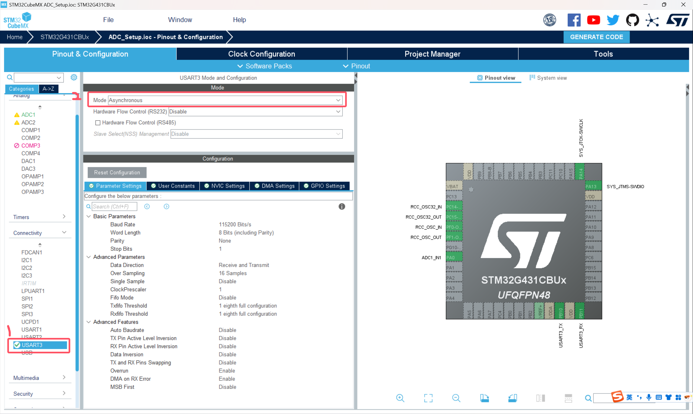
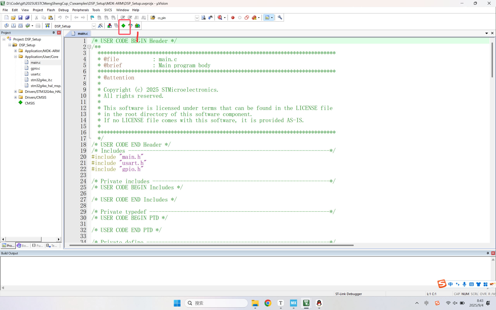

# 2025盟升杯电子设计竞赛C题

## DSP配置教程 By ConstString

### 本例程已上传examples文件夹

### 创建工程(前半部分和ADC教程配置相同)

**1.打开STM32CUBEMX软件，选择FILE -> New Project, 搜索本次器件包中发放的单片机型号：STM32G431CBU6**


**2.在搜索结果中选中型号后点击Start Project，出现如下界面，接下来我们一步步配置左侧的外设**


**3.先配置RCC时钟来源，选择高速和低速时钟源均为晶振，其他不用管**


**4.点击SYS，在Debug选项选择Serial Wire，这一步非常重要，在今后的工程中一定不要忘记这一步。这一步操作的目的是开启程序烧录和调试的接口，如果忘记这一步，下一次程序将无法烧录到芯片中！需要使用串口下载解锁（自行搜索）**


**5.需要开启串口用于打印调试信息，使用串口助手观察DSP库工作是否正常**

**6.最后完成单片机时钟配置，和ADC教程部分相同。切换到上方的Clock Configuration，下面是STM32G431是时钟树**


**7.左侧选择晶振频率，开发板上的晶振频率就是8MHz，这里不用修改。我们直接在右侧框中输入170（就是170，该单片机的最大主频）尝试让CUBEMX自动设置，一路OK。然后发现Cubemx找不到170MHz的解，帮我们设置成了150MHz**


**但事实上频率是完全可以拉到170MHz的，我们只需要把锁相环倍数拉到X85**


**8.配置已经全部完成，接下来就是生成工程了**。**上方切换到Project Manager，填写工程名和路径，选择工具链为MDK-ARM**


**9.（可选）生成.h文件，方便管理**


**10.点击右上角GENERATE CODE生成**


### 编写代码

#### 注意：请在CubeMX生成的begin和end之间写自己的代码，不然下次使用CubeMX时会被覆盖！！！

**在这种地方写**


**1.在keil中添加DSP库**

点击包管理器



添加DSP库


还需要为编译器提供宏定义，启用DSP库

在原有宏定义后面添加宏定义，添加后应该是：

```
USE_HAL_DRIVER,STM32G431xx,ARM_MATH_CM4,__CC_ARM,ARM_MATH_M
```


先不要急着关闭窗口，我们还需要确认自己的编译器版本。


如果没有v5编译器版本选项，需要自行安装，安装方法（安装包见群文件）：

https://blog.csdn.net/m0_64638618/article/details/147478663

编译一下没有error就可以了，warning不需要管


**2.频率成分提取**

我们先创建一个512点的测试数组，存放了正弦波的模拟采样数据，实际应用中应该替换成你的ADC采样数据。数组使用static声明是将其创建在内存堆区，防止栈溢出（感兴趣自行搜索，大数组如果没法运行加上static试试）

```C
#include <math.h>

static float test_input[512];
for (int i = 0; i < 512; i++)
{
	test_input[i] = sinf(2 * PI * i / 64);
}
```

我们想要做的是提取出这个信号的频率成分

为什么要提取频率成分（讲座PPT）


在进行DSP处理频率成分前，需要对原始数据进行一些特殊的处理，具体操作为在一个有效数据后面跟上一个0（实质是将虚部置为0，输入为复数信号），如下所示：

```C
static float dsp_inputBuffer[1024];
for (int i = 0; i < 512; i++)
{
    dsp_inputBuffer[2 * i] = test_input[i];
    dsp_inputBuffer[2 * i + 1] = 0;
}
```

先定义好结果的输出数组，我们调用下面两行函数，需要先包含必要的库

```C
#include "arm_math.h"
#include "arm_const_structs.h"

static float dsp_outputBuffer[512];
arm_cfft_f32(&arm_cfft_sR_f32_len512, dsp_inputBuffer, 0, 1);
arm_cmplx_mag_f32(dsp_inputBuffer, dsp_outputBuffer, 512);
```

至此，其实DSP处理部分已经结束了，频率成分结果已经保存在数组dsp_outputBuffer中。稍后我将为大家讲解这个数组中结果的具体含义和相关计算。下一步我们将用串口打印将DSP结果可视化，方便大家直观理解。

添加串口myprintf函数，具体方法参考ADC配置教程

```C
#include <string.h>
#include <stdarg.h>
#include <stdio.h>

int myprintf(const char *format, ...)
{
    char buffer[128]; 
    va_list args;
    va_start(args, format);
    vsnprintf(buffer, sizeof(buffer), format, args);
    va_end(args);

    return HAL_UART_Transmit(&huart3, (uint8_t*)buffer, strlen(buffer), HAL_MAX_DELAY);
}
```

我们将DSP处理结果通过串口打印，这里我们把数组索引和值都打印出来

```C
for (int i = 0; i < 512; i++)
{
 	myprintf("DSP Result:%d,%f\n", i, dsp_outputBuffer[i]);
}
```

编译烧录后重启开发板


打开vofa串口助手，使用USB转串口工具连接到开发板（连接方法见ADC配置教程），打开波形绘制功能（方法见ADC配置教程），先重启开发板，确定串口正常打印


接下来右键绘图区，选择Y轴数据源为数组的值，即串口打印的第二个参数


在刚刚的页面继续设置X轴数据源为数组索引


再次重启单片机，可以看到在绘图窗口成功绘制出图像，如果找不到图像可以点一下AUTO再缩放。可以看到在最左侧和最右侧有两个对称的峰，左侧峰值出现在（8,256），这个峰值就是我们想要的频率信息。关于这个信息如何使用，将在下一部分相关计算讲解


**3.混合信号提取展示**

为了让大家更直观的体会这个峰值和频率的对应关系，我将上一部分输入的单一正弦信号改成混合信号，三个正弦波相加，频率分别为f，8f，16f，幅值分别为4A，2A，A

```c
static float test_input[512]={0};
for (int i = 0; i < 512; i++)
{
    test_input[i] += 4 * sinf(2 * PI * i / 64);
    test_input[i] += 2 * sinf(2 * PI * i / 8);
    test_input[i] += 1 * sinf(2 * PI * i / 4);
}
```

再次绘图，输出如下。可以看到三个混合在一起的信号在频率上确实被分离了出来，每个信号的幅值也和峰值相关


### 相关计算


### 进阶处理

#### 加窗和频谱泄露