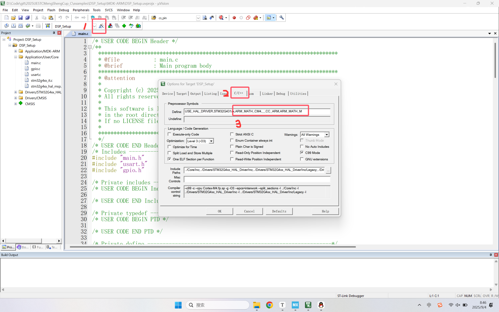

# 2025盟升杯电子设计竞赛C题

## DSP配置教程 By ConstString

### 本例程已上传examples文件夹

### 创建工程(前半部分和ADC教程配置相同)

**1.打开STM32CUBEMX软件，选择FILE -> New Project, 搜索本次器件包中发放的单片机型号：STM32G431CBU6**


**2.在搜索结果中选中型号后点击Start Project，出现如下界面，接下来我们一步步配置左侧的外设**


**3.先配置RCC时钟来源，选择高速和低速时钟源均为晶振，其他不用管**


**4.点击SYS，在Debug选项选择Serial Wire，这一步非常重要，在今后的工程中一定不要忘记这一步。这一步操作的目的是开启程序烧录和调试的接口，如果忘记这一步，下一次程序将无法烧录到芯片中！需要使用串口下载解锁（自行搜索）**


**5.需要开启串口用于打印调试信息，使用串口助手观察DSP库工作是否正常**

**6.最后完成单片机时钟配置，和ADC教程部分相同。切换到上方的Clock Configuration，下面是STM32G431是时钟树**


**7.左侧选择晶振频率，开发板上的晶振频率就是8MHz，这里不用修改。我们直接在右侧框中输入170（就是170，该单片机的最大主频）尝试让CUBEMX自动设置，一路OK。然后发现Cubemx找不到170MHz的解，帮我们设置成了150MHz**


**但事实上频率是完全可以拉到170MHz的，我们只需要把锁相环倍数拉到X85**


**8.配置已经全部完成，接下来就是生成工程了**。**上方切换到Project Manager，填写工程名和路径，选择工具链为MDK-ARM**


**9.（可选）生成.h文件，方便管理**


**10.点击右上角GENERATE CODE生成**


### 编写代码

#### 注意：请在CubeMX生成的begin和end之间写自己的代码，不然下次使用CubeMX时会被覆盖！！！

**在这种地方写**


**1.在keil中添加DSP库**

点击包管理器


添加DSP库


还需要为编译器提供宏定义，启用DSP库

在原有宏定义后面添加宏定义，添加后应该是：

```
USE_HAL_DRIVER,STM32G431xx,ARM_MATH_CM4,__CC_ARM,ARM_MATH_M
```



先不要急着关闭窗口，我们还需要确认自己的编译器版本。


如果没有v5编译器版本选项，需要自行安装，安装方法（安装包见群文件）：

https://blog.csdn.net/m0_64638618/article/details/147478663

编译一下没有error就可以了，warning不需要管


**2.频率成分提取**

我们先创建一个512点的测试数组，存放了正弦波的模拟采样数据，实际应用中应该替换成你的ADC采样数据。数组使用static声明是将其创建在内存堆区，防止栈溢出（感兴趣自行搜索，大数组如果没法运行加上static试试）

```C
#include <math.h>

static float test_input[512];
for (int i = 0; i < 512; i++)
{
	test_input[i] = sinf(2 * PI * i / 64);
}
```

我们想要做的是提取出这个信号的频率成分

为什么要提取频率成分（讲座PPT）


在进行DSP处理频率成分前，需要对原始数据进行一些特殊的处理，具体操作为在一个有效数据后面跟上一个0（实质是将虚部置为0，输入为复数信号），如下所示：

```C
static float dsp_inputBuffer[1024];
for (int i = 0; i < 512; i++)
{
    dsp_inputBuffer[2 * i] = test_input[i];
    dsp_inputBuffer[2 * i + 1] = 0;
}
```

先定义好结果的输出数组，我们调用下面两行函数，需要先包含必要的库

```C
#include "arm_math.h"
#include "arm_const_structs.h"

static float dsp_outputBuffer[512];
arm_cfft_f32(&arm_cfft_sR_f32_len512, dsp_inputBuffer, 0, 1); // arm_cfft_sR_f32_len1024即长度为1024，必须是2^n
arm_cmplx_mag_f32(dsp_inputBuffer, dsp_outputBuffer, 512);
```

至此，其实DSP处理部分已经结束了，频率成分结果已经保存在数组dsp_outputBuffer中。稍后我将为大家讲解这个数组中结果的具体含义和相关计算。下一步我们将用串口打印将DSP结果可视化，方便大家直观理解。

添加串口myprintf函数，具体方法参考ADC配置教程

```C
#include <string.h>
#include <stdarg.h>
#include <stdio.h>

int myprintf(const char *format, ...)
{
    char buffer[128]; 
    va_list args;
    va_start(args, format);
    vsnprintf(buffer, sizeof(buffer), format, args);
    va_end(args);

    return HAL_UART_Transmit(&huart3, (uint8_t*)buffer, strlen(buffer), HAL_MAX_DELAY);
}
```

我们将DSP处理结果通过串口打印，这里我们把数组索引和值都打印出来

```C
for (int i = 0; i < 512; i++)
{
 	myprintf("DSP Result:%d,%f\n", i, dsp_outputBuffer[i]);
}
```

编译烧录后重启开发板


打开vofa串口助手，使用USB转串口工具连接到开发板（连接方法见ADC配置教程），打开波形绘制功能（方法见ADC配置教程），先重启开发板，确定串口正常打印


接下来右键绘图区，选择Y轴数据源为数组的值，即串口打印的第二个参数


在刚刚的页面继续设置X轴数据源为数组索引


再次重启单片机，可以看到在绘图窗口成功绘制出图像，如果找不到图像可以点一下AUTO再缩放。可以看到在最左侧和最右侧有两个对称的峰，左侧峰值出现在（8,256），这个峰值就是我们想要的频率信息。关于这个信息如何使用，将在下一部分相关计算讲解


**3.混合信号提取展示**

为了让大家更直观的体会这个峰值和频率的对应关系，我将上一部分输入的单一正弦信号改成混合信号，三个正弦波相加，频率分别为f，8f，16f，幅值分别为4A，2A，A

```c
static float test_input[512]={0};
for (int i = 0; i < 512; i++)
{
    test_input[i] += 4 * sinf(2 * PI * i / 64);
    test_input[i] += 2 * sinf(2 * PI * i / 8);
    test_input[i] += 1 * sinf(2 * PI * i / 4);
}
```

再次绘图，输出如下。可以看到三个混合在一起的信号在频率上确实被分离了出来，每个信号的幅值也和峰值相关


### 相关计算

**以上面的混合信号为例，进行相关计算**

对于现实中的信号（实信号），频率成分总是关于中心对称的，因此我们只需要关心前一半的图像即可

**1.频率计算**

我们假定数组是由采样率为512kHz的ADC采样得到的（只有引入时间才能计算频率）

在数组索引i处对应的频率为：


计算第一峰值处的频率，索引为8，因此频率为8kHz，与我们的设定值相同，频率分离正确

**2.幅度计算**

设索引i处的值为x，幅度计算方法为：


对于第一峰值，坐标为（8,1024），计算得出幅度值为4，与设定值相同，幅度分离正确

**3.频率分辨率**

从频率计算部分可以看出，频率分辨率（或步进）为采样率和采样长度的比值。因此采样率越低或采样长度越长分辨率越高。但分辨率无法无限制的提高。首先，增大采样长度会大幅度增大内存占用，使得单片机资源不足。而采样率过低可能造成混叠现象，将在下一部分讨论

**4.混叠与奈奎斯特采样定理**

**奈奎斯特定理（Nyquist Theorem）**

**定理内容：要准确重建一个信号，采样率必须至少是信号最高频率的2倍。**


 **什么是混叠（Aliasing）？**

**混叠**是指当采样率不满足奈奎斯特定理时，高频信号会被错误地识别为低频信号的现象。

形象比喻：想象一个旋转的轮子：

- 如果拍摄速度（采样率）足够快，能看出轮子正常旋转
- 如果拍摄速度太慢，轮子看起来可能是静止的，甚至倒转
- 这就是"混叠"现象


满足奈奎斯特采样定理，f_sample = 4*f_signal


不满足奈奎斯特采样定理，5Hz与3Hz信号混叠，无法区分


### 进阶处理：加窗和频谱泄露

**提示，这部分内容属于进阶内容，请根据自己的掌握情况酌情学习，属于优化方案**

**！！！强烈建议将前面所有部分实际操作后再阅读后面的部分！！！**

**我们之前所做的“频率分离提取”本质上就是对信号做傅里叶变换（被骗到了吧哈哈），而我们采用的算法被称作快速傅里叶变换FFT（Fast Fourier Transform Algorithm），其实也没用你想象中的那么难，下面我们将讨论FFT中的经典问题：频谱泄露**

#### 问题的产生

当我们用FFT分析信号时，实际上是对**有限长度**的信号进行分析，这就像从一个无限长的信号中"切出"一段来分析。

**结果**：

- 原本集中在一个频率点的能量，"泄露"到了周围的频率
- 频谱分辨率下降
- 可能掩盖附近的小信号

#### 为什么会发生频谱泄露？

FFT假设信号是**周期性的**，但我们截取的信号段在首尾往往不连接

#### 什么是加窗？

**加窗**就是用一个特殊的函数（窗函数）去乘以原始信号，让信号在截取边界处平滑过渡到零。

**1.矩形窗（Rectangle Window）**

```
w[n] = 1    (就是不加窗)
```

- 最简单，但频谱泄露最严重

**2.汉宁窗（Hanning Window）**

```
w[n] = 0.5 - 0.5*cos(2πn/(N-1))
```

- 最常用的窗函数
- 平衡了泄露抑制和主瓣宽度

**3.汉明窗（Hamming Window）**

```
w[n] = 0.54 - 0.46*cos(2πn/(N-1))
```

- 旁瓣抑制更好

#### STM32应用实例

由原始数据乘上窗函数

```C
fft_inputbuf[2 * i] = Process_Buffer[i] * 0.5f * (1.0f - cosf(2 * PI * i / (FFT_LENGTH - 1)));
```

### 结语

**恭喜你翻过信号处理的一座大山：从时间域到频率域的转化，这不仅是一种算法，更是思维上的转化。过去复杂难解的信号转化到频域上就变得豁然开朗。大多数同学都会在大二学年学习《信号与系统》，将会更深入地理解这一部分内容**

**教程制作实属不易，这一部分尤为痛苦，需要用较为通俗的语言帮助大家理解（我尽力了），希望能够帮到大家，如果觉得有问题或者没有讲清楚的地方欢迎通过QQ等方式向我提出，预祝大家比赛取得好成绩！**

### 完整代码

**main.c**

```C
/* USER CODE BEGIN Header */
/**
  ******************************************************************************
  * @file           : main.c
  * @brief          : Main program body
  ******************************************************************************
  * @attention
  *
  * Copyright (c) 2025 STMicroelectronics.
  * All rights reserved.
  *
  * This software is licensed under terms that can be found in the LICENSE file
  * in the root directory of this software component.
  * If no LICENSE file comes with this software, it is provided AS-IS.
  *
  ******************************************************************************
  */
/* USER CODE END Header */
/* Includes ------------------------------------------------------------------*/
#include "main.h"
#include "usart.h"
#include "gpio.h"

/* Private includes ----------------------------------------------------------*/
/* USER CODE BEGIN Includes */
#include <math.h>
#include <string.h>
#include <stdarg.h>
#include <stdio.h>
#include "arm_math.h"
#include "arm_const_structs.h"
/* USER CODE END Includes */

/* Private typedef -----------------------------------------------------------*/
/* USER CODE BEGIN PTD */

/* USER CODE END PTD */

/* Private define ------------------------------------------------------------*/
/* USER CODE BEGIN PD */
int myprintf(const char *format, ...)
{
    char buffer[128]; 
    va_list args;
    va_start(args, format);
    vsnprintf(buffer, sizeof(buffer), format, args);
    va_end(args);

    return HAL_UART_Transmit(&huart3, (uint8_t*)buffer, strlen(buffer), HAL_MAX_DELAY);
}
/* USER CODE END PD */

/* Private macro -------------------------------------------------------------*/
/* USER CODE BEGIN PM */

/* USER CODE END PM */

/* Private variables ---------------------------------------------------------*/

/* USER CODE BEGIN PV */

/* USER CODE END PV */

/* Private function prototypes -----------------------------------------------*/
void SystemClock_Config(void);
/* USER CODE BEGIN PFP */

/* USER CODE END PFP */

/* Private user code ---------------------------------------------------------*/
/* USER CODE BEGIN 0 */

/* USER CODE END 0 */

/**
  * @brief  The application entry point.
  * @retval int
  */
int main(void)
{
  /* USER CODE BEGIN 1 */

  /* USER CODE END 1 */

  /* MCU Configuration--------------------------------------------------------*/

  /* Reset of all peripherals, Initializes the Flash interface and the Systick. */
  HAL_Init();

  /* USER CODE BEGIN Init */

  /* USER CODE END Init */

  /* Configure the system clock */
  SystemClock_Config();

  /* USER CODE BEGIN SysInit */

  /* USER CODE END SysInit */

  /* Initialize all configured peripherals */
  MX_GPIO_Init();
  MX_USART3_UART_Init();
  /* USER CODE BEGIN 2 */
  static float test_input[512]={0};
  for (int i = 0; i < 512; i++)
  {
	test_input[i] += 4 * sinf(2 * PI * i / 64);
	test_input[i] += 2 * sinf(2 * PI * i / 8);
	test_input[i] += 1 * sinf(2 * PI * i / 4);
  }
  static float dsp_inputBuffer[1024];
  for (int i = 0; i < 512; i++)
  {
	dsp_inputBuffer[2 * i] = test_input[i];
	dsp_inputBuffer[2 * i + 1] = 0;
  }
  
  static float dsp_outputBuffer[512];
  arm_cfft_f32(&arm_cfft_sR_f32_len512, dsp_inputBuffer, 0, 1);
  arm_cmplx_mag_f32(dsp_inputBuffer, dsp_outputBuffer, 512);
  
  for (int i = 0; i < 512; i++)
  {
	  myprintf("DSP Result:%d,%f\n", i, dsp_outputBuffer[i]);
  }
  /* USER CODE END 2 */

  /* Infinite loop */
  /* USER CODE BEGIN WHILE */
  while (1)
  {
    /* USER CODE END WHILE */

    /* USER CODE BEGIN 3 */
  }
  /* USER CODE END 3 */
}

/**
  * @brief System Clock Configuration
  * @retval None
  */
void SystemClock_Config(void)
{
  RCC_OscInitTypeDef RCC_OscInitStruct = {0};
  RCC_ClkInitTypeDef RCC_ClkInitStruct = {0};

  /** Configure the main internal regulator output voltage
  */
  HAL_PWREx_ControlVoltageScaling(PWR_REGULATOR_VOLTAGE_SCALE1_BOOST);

  /** Initializes the RCC Oscillators according to the specified parameters
  * in the RCC_OscInitTypeDef structure.
  */
  RCC_OscInitStruct.OscillatorType = RCC_OSCILLATORTYPE_HSE;
  RCC_OscInitStruct.HSEState = RCC_HSE_ON;
  RCC_OscInitStruct.PLL.PLLState = RCC_PLL_ON;
  RCC_OscInitStruct.PLL.PLLSource = RCC_PLLSOURCE_HSE;
  RCC_OscInitStruct.PLL.PLLM = RCC_PLLM_DIV2;
  RCC_OscInitStruct.PLL.PLLN = 85;
  RCC_OscInitStruct.PLL.PLLP = RCC_PLLP_DIV2;
  RCC_OscInitStruct.PLL.PLLQ = RCC_PLLQ_DIV2;
  RCC_OscInitStruct.PLL.PLLR = RCC_PLLR_DIV2;
  if (HAL_RCC_OscConfig(&RCC_OscInitStruct) != HAL_OK)
  {
    Error_Handler();
  }

  /** Initializes the CPU, AHB and APB buses clocks
  */
  RCC_ClkInitStruct.ClockType = RCC_CLOCKTYPE_HCLK|RCC_CLOCKTYPE_SYSCLK
                              |RCC_CLOCKTYPE_PCLK1|RCC_CLOCKTYPE_PCLK2;
  RCC_ClkInitStruct.SYSCLKSource = RCC_SYSCLKSOURCE_PLLCLK;
  RCC_ClkInitStruct.AHBCLKDivider = RCC_SYSCLK_DIV1;
  RCC_ClkInitStruct.APB1CLKDivider = RCC_HCLK_DIV1;
  RCC_ClkInitStruct.APB2CLKDivider = RCC_HCLK_DIV1;

  if (HAL_RCC_ClockConfig(&RCC_ClkInitStruct, FLASH_LATENCY_4) != HAL_OK)
  {
    Error_Handler();
  }
}

/* USER CODE BEGIN 4 */

/* USER CODE END 4 */

/**
  * @brief  This function is executed in case of error occurrence.
  * @retval None
  */
void Error_Handler(void)
{
  /* USER CODE BEGIN Error_Handler_Debug */
  /* User can add his own implementation to report the HAL error return state */
  __disable_irq();
  while (1)
  {
  }
  /* USER CODE END Error_Handler_Debug */
}

#ifdef  USE_FULL_ASSERT
/**
  * @brief  Reports the name of the source file and the source line number
  *         where the assert_param error has occurred.
  * @param  file: pointer to the source file name
  * @param  line: assert_param error line source number
  * @retval None
  */
void assert_failed(uint8_t *file, uint32_t line)
{
  /* USER CODE BEGIN 6 */
  /* User can add his own implementation to report the file name and line number,
     ex: printf("Wrong parameters value: file %s on line %d\r\n", file, line) */
  /* USER CODE END 6 */
}
#endif /* USE_FULL_ASSERT */

```

